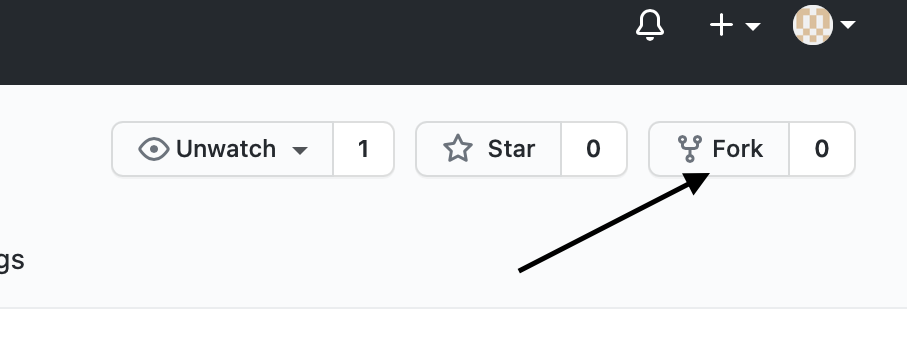

# Game Reviews API

## Description

This project was to build an API for the purpose of accessing application data programmatically.

The intention was to mimick the building of a real world backend service (such as reddit) that provides information to a front end architecture.

The API stores, grants access to, and allows modification of game review information as well as the associated user details, by way of a relational PSQL database.

[Click here to view the hosted version of this API.](https://game-reviews-project.herokuapp.com/api)
(You may need to install a 'JSON formatter' browser extension in order to view the detail in a readable format.)

## Setup

- **Fork** this repo  
  

- **Clone** to your local machine  
  `git clone https://github.com/PaulOR26/game-reviews-api.git`

- **Install** dependencies  
  `npm install`

- **Define environment**

  - Create file:  
    `.env.test`  
    Include within file: `PGDATABASE=game_reviews_test`

  - Create file:  
    `.env.development`  
    Include within file: `PGDATABASE=game_reviews`

  Double check these files (_as well as your node_modules_) are included within the .gitignore file.

- **Create the database**  
  `npm run setup-dbs`

- **Seed the database**  
  `npm run seed`

## Testing

- Test the endpoints  
  `npm test app`
- Test the database seeding utility functions  
  `npm test utils`

## Requirements

- **Node.js** v16.3.0
- **Postgres** v13.3
